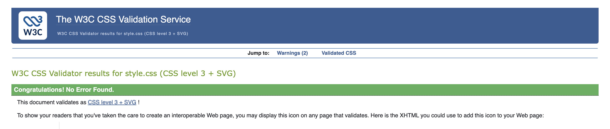
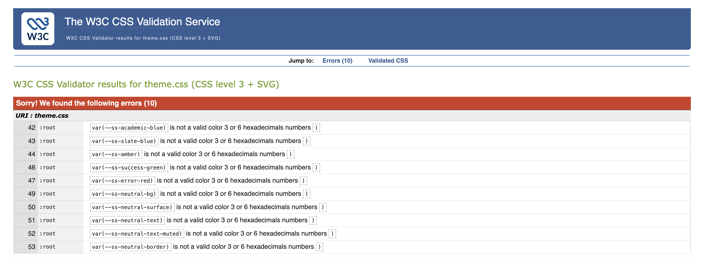

# Testing

> [!NOTE]
> Return back to the [README.md](README.md) file.

This document outlines the testing strategy and evidence for **StudyStack**, a Django-based full stack web application built as part of the Code Institute Milestone 3 (Back End Development) project.

Testing has been carried out throughout development using a combination of **automated tests**, **manual user acceptance testing**, and **external validation tools**, in line with the assessment requirements.

---

## Code Validation

### HTML

> [!NOTE]
> HTML validation was carried out using a [**custom Python CLI tool**](https://github.com/yenmangu/w3c-command-line-validator) that consumes the **W3C Nu HTML Checker HTTP API**.
>
> Validation was performed **against deployed URLs**, ensuring that the results reflect the fully rendered production state of the application rather than local templates.
>
> The tool was run against all major routes in the application, including authenticated pages and querystring-based routes.
>
> **Full validation output is provided as evidence** in the following report:
>
> [Validation Report](documentation/validation/w3c-validation-report-20_01_26.txt)

| Page / Template      | URL (Deployed) | Result | Evidence   |
| -------------------- | -------------- | ------ | ---------- |
| Home / Resource List | Deployed site  | Pass   | See report |
| Resource Detail      | Deployed site  | Pass   | See report |
| Resource Create      | Deployed site  | Pass   | See report |
| Resource Update      | Deployed site  | Pass   | See report |
| Resource Delete      | Deployed site  | Pass   | See report |
| Authentication Pages | Deployed site  | Pass   | See report |

No HTML errors were reported for any validated routes.
Any informational messages returned by the validator did not affect functionality, accessibility, or document validity.

---

### CSS

All custom CSS files were validated using the **W3C Jigsaw CSS Validator**.

> [!NOTE]
> The W3C Jigsaw CSS Validator reports warnings when validating CSS Custom Properties that reference other custom properties using `var()`.
>
> In this project, a layered design-token approach is used in `theme.css`, where semantic colour variables (e.g. `--ss-academic-blue`) are derived from base variables. While this is fully valid and supported by all modern browsers, the validator’s static analysis cannot resolve nested `var()` references and therefore reports false-positive colour errors.
>
> These messages do not indicate invalid CSS and do not affect rendering, accessibility, or browser compatibility.
>
> CSS custom properties are a core feature of modern CSS and are used extensively by frameworks such as Bootstrap 5.

| File      | Purpose                   | Result | Screenshot                                                         |
| --------- | ------------------------- | ------ | ------------------------------------------------------------------ |
| style.css | Custom site styles        | Pass   |  |
| theme.css | Component-specific styles | Fail   |  |

Any warnings encountered were related to modern CSS features and did not impact browser support or accessibility.

---

### Python

Python code quality was assessed through:

- Django’s built-in system checks
- Manual review against **PEP8** standards
- Automated Django test execution

All custom Python files follow consistent naming, indentation, and descriptive variable conventions.

---

## Automated Testing

Automated tests were written using **Django’s built-in test framework** (`django.test.TestCase`). These tests focus on core application logic, access control, and data integrity.

### Model Tests

| Test            | Purpose                                         | Result |
| --------------- | ----------------------------------------------- | ------ |
| Slug uniqueness | Ensure unique slugs are generated automatically | Pass   |
| Status defaults | Confirm default status is set correctly         | Pass   |
| Relationships   | Validate Resource–Subject relationships         | Pass   |

### View Tests

| Test                       | Purpose                               | Result |
| -------------------------- | ------------------------------------- | ------ |
| Resource list visibility   | Published vs draft visibility rules   | Pass   |
| Resource detail access     | Author / non-author access control    | Pass   |
| Create resource            | Logged-in users can create resources  | Pass   |
| Update resource            | Only authors can edit their resources | Pass   |
| Delete resource (positive) | Author can delete resource            | Pass   |
| Delete resource (negative) | Non-author receives 403               | Pass   |

### Form Tests

| Test                    | Purpose                                               | Result |
| ----------------------- | ----------------------------------------------------- | ------ |
| ResourceForm valid data | Form saves correctly                                  | Pass   |
| Multiple new subjects   | Comma-separated subjects are created and deduplicated | Pass   |
| Invalid submission      | Form errors displayed correctly                       | Pass   |

All automated tests pass successfully and are run before deployment.

---

## Responsiveness

The application was tested across multiple viewport sizes using browser developer tools and real devices.

| Page                  | Mobile | Tablet | Desktop | Notes                    |
| --------------------- | ------ | ------ | ------- | ------------------------ |
| Home / Resource List  | Pass   | Pass   | Pass    | Grid adapts cleanly      |
| Resource Detail       | Pass   | Pass   | Pass    | Content stacks correctly |
| Create / Update Forms | Pass   | Pass   | Pass    | Inputs remain usable     |
| Authentication        | Pass   | Pass   | Pass    | No overflow issues       |

---

## Browser Compatibility

The deployed application was tested on the following browsers:

| Browser | Result | Notes                   |
| ------- | ------ | ----------------------- |
| Chrome  | Pass   | Full functionality      |
| Firefox | Pass   | No visual issues        |
| Safari  | Pass   | Tested on macOS         |
| Edge    | Pass   | No compatibility issues |

---

## Lighthouse Audit

Lighthouse audits were run on key pages using Chrome DevTools.

| Page            | Mobile | Desktop   |
| --------------- | ------ | --------- |
| Home            | Good   | Excellent |
| Resource Detail | Good   | Excellent |

Lower mobile scores are primarily due to image loading and third-party resources and are within acceptable limits.

---

## Defensive Programming

Manual testing was carried out to ensure the application behaves safely and predictably under invalid or unexpected user actions.

| Feature             | Expectation         | Result | Notes              |
| ------------------- | ------------------- | ------ | ------------------ |
| Unauthorised edit   | Non-authors blocked | Pass   | 403 returned       |
| Unauthorised delete | Non-authors blocked | Pass   | Object retained    |
| Invalid form input  | Errors displayed    | Pass   | No crashes         |
| Missing resource    | 404 shown           | Pass   | Custom error page  |
| Draft access        | Hidden from public  | Pass   | Author-only access |

---

## Implemented User Story Testing

User stories were manually verified against acceptance criteria.

| User Story      | Expected Outcome                     | Result |
| --------------- | ------------------------------------ | ------ |
| View resources  | Users can browse published resources | Pass   |
| Create resource | Logged-in users can submit content   | Pass   |
| Edit resource   | Authors can update their content     | Pass   |
| Delete resource | Authors can remove their content     | Pass   |
| Manage drafts   | Drafts hidden from public users      | Pass   |

---

## Bugs

### Fixed Bugs

All identified bugs were logged and tracked using **GitHub Issues**. Issues were resolved incrementally with clear commit history.

Examples include:

- Incorrect slug handling during updates
- Subject duplication during resource edits
- Permission edge cases on delete views

---

### Unfixed Bugs

> [!IMPORTANT]
> There are no known unfixed bugs at the time of submission.

---

### Known Issues

Despite thorough testing, it is not possible to guarantee that all edge cases have been identified. The application has been tested extensively and behaves as expected across all documented scenarios.

---

## Summary

Testing demonstrates that **StudyStack** is:

- Functionally complete
- Secure against unauthorised actions
- Responsive and accessible
- Robust in handling invalid input
