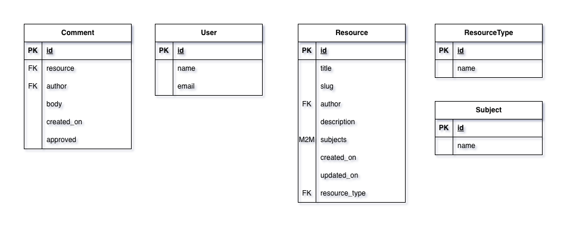
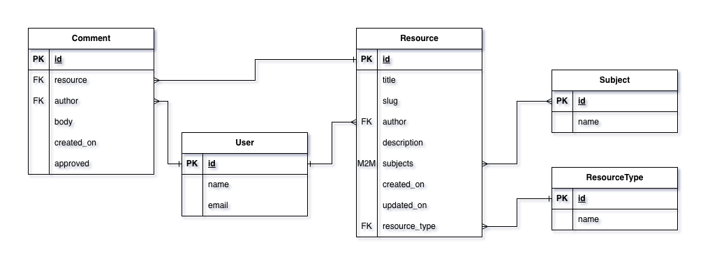

# Database Design

## Overview

Brief explanation of why a relational database was chosen.

## Entities

> [!NOTE]
> Foreign key fields are placed on the many side of each relationship,
> allowing multiple records to reference a single related entity.

### User

The **User** entity represents registered users of the StudyStack platform.
Users can create study resources and submit comments.

#### Fields

| Field | Type       | Description                    |
| ----- | ---------- | ------------------------------ |
| id    | PK         | Unique identifier for the user |
| name  | CharField  | Display name of the user       |
| email | EmailField | User’s email address           |

#### Relationships

- A **User** can author multiple **Resources** (one-to-many).
- A **User** can author multiple **Comments** (one-to-many).

### Resource

The **Resource** entity represents a study resource shared on the StudyStack platform.
Resources are created by users and categorised by subject and resource type.

#### Fields

| Field       | Type          | Description                            |
| ----------- | ------------- | -------------------------------------- |
| id          | PK            | Unique identifier for the resource     |
| title       | CharField     | Title of the resource                  |
| slug        | SlugField     | URL-friendly identifier                |
| description | TextField     | Summary or description of the resource |
| created_on  | DateTimeField | Date the resource was created          |
| updated_on  | DateTimeField | Date the resource was last updated     |

#### Relationships

- Each **Resource** is authored by one **User** (many-to-one).
- Each **Resource** belongs to one **ResourceType** (many-to-one).
- Each **Resource** can be associated with multiple **Subjects** (many-to-many).
- Each **Resource** can have multiple **Comments** (one-to-many).

### ResourceType

The **ResourceType** entity represents the format of a study resource, such as a PDF, video, or article.
This allows consistent categorisation of resources by format.

#### Fields

| Field | Type      | Description                             |
| ----- | --------- | --------------------------------------- |
| id    | PK        | Unique identifier for the resource type |
| name  | CharField | Name of the resource type               |

#### Relationships

- A **ResourceType** can be linked to multiple **Resources** (one-to-many).

### Subject

The **Subject** entity represents a topic or area of study used to categorise resources.
Subjects allow users to browse and filter resources by topic.

#### Fields

| Field | Type      | Description                       |
| ----- | --------- | --------------------------------- |
| id    | PK        | Unique identifier for the subject |
| name  | CharField | Name of the subject               |

#### Many-to-Many Relationship (Resource ↔ Subject)

Resources and Subjects share a many-to-many relationship.

Instead of using Django’s implicit join table, an **explicit join model** is used:

#### SubjectResourceJoin

This model represents the association between a Resource and a Subject.

**Why an explicit join model was chosen:**

- Makes the relationship itself a first-class entity
- Allows enforcement of business rules at the database level
- Enables future extension (e.g. timestamps, ordering, moderation metadata)
- Improves clarity when reasoning about the schema

**Constraints:**

- A composite unique constraint ensures each Resource–Subject pair is unique
- Prevents duplicate associations at the database level

## Relationship Summary

- A **User** can submit multiple **Resources**.
- Each **Resource** is authored by one **User**.
- Each **Resource** can be associated with multiple **Subjects**.
- Each **Resource** belongs to one **ResourceType**.
- A **Subject** can be linked to multiple **Resources**.
- A **ResourceType** can be linked to multiple **Resources**.

## Entity Relationship Diagram

This diagram represents the conceptual structure of the core entities within StudyStack and the relationships between them.

Foreign keys are shown on the owning (many) side of each relationship. Reverse relationships are handled automatically by Django’s ORM and are therefore not stored explicitly as database fields.

The diagram uses [Crow's foot notation](https://en.wikipedia.org/wiki/Entity%E2%80%93relationship_model#Crow's_foot_notation) to illustrate relationship cadinality between entities.

## Data Integrity & Constraints

- Foreign key relationships enforce referential integrity
- Cascade deletion ensures orphaned rows cannot exist
- Composite uniqueness constraints enforce domain rules
- Defaults and non-null constraints are applied intentionally

## Admin & ORM Considerations

- Explicit join models require custom admin handling
- Django Admin inlines are used to manage Resource–Subject associations
- ORM queries transparently route through the join table
- Reverse relationship names are explicitly defined for readability

<!-- NEW -->

# Database Design

## Overview

A relational database was selected for StudyStack to ensure structured data storage, strong relational integrity, and long-term scalability.
This approach supports clear relationships between users, resources, and categorisation entities, while enabling efficient querying, filtering, and validation.

The database schema was designed prior to implementation using an Entity Relationship Diagram (ERD) and then translated into Django models.

## Entities

> [!NOTE]
> Foreign key fields are placed on the _many_ side of each relationship,
> allowing multiple records to reference a single related entity.
> Reverse relationships are handled automatically by Django’s ORM.

### User

The **User** entity represents registered users of the StudyStack platform.
Users are responsible for creating study resources and submitting comments.

#### Fields

| Field | Type       | Description                    |
| ----- | ---------- | ------------------------------ |
| id    | PK         | Unique identifier for the user |
| name  | CharField  | Display name of the user       |
| email | EmailField | User’s email address           |

#### Relationships

- A **User** can author multiple **Resources** (one-to-many).
- A **User** can author multiple **Comments** (one-to-many).

This structure enforces ownership and accountability for user-generated content.

### Resource

The **Resource** entity represents a study resource shared on the StudyStack platform.
Resources are authored by users and categorised by subject and resource type.

#### Fields

| Field       | Type          | Description                            |
| ----------- | ------------- | -------------------------------------- |
| id          | PK            | Unique identifier for the resource     |
| title       | CharField     | Title of the resource                  |
| slug        | SlugField     | URL-friendly unique identifier         |
| description | TextField     | Summary or description of the resource |
| created_on  | DateTimeField | Date the resource was created          |
| updated_on  | DateTimeField | Date the resource was last updated     |

#### Relationships

- Each **Resource** is authored by one **User** (many-to-one).
- Each **Resource** belongs to one **ResourceType** (many-to-one).
- Each **Resource** can be associated with multiple **Subjects** (many-to-many).
- Each **Resource** can have multiple **Comments** (one-to-many).

This design supports flexible categorisation while maintaining clear ownership.

### ResourceType

The **ResourceType** entity represents the format of a study resource, such as a PDF, video, or article.
This allows resources to be categorised consistently by format and filtered efficiently.

#### Fields

| Field | Type      | Description                             |
| ----- | --------- | --------------------------------------- |
| id    | PK        | Unique identifier for the resource type |
| name  | CharField | Name of the resource type               |

#### Relationships

- A **ResourceType** can be linked to multiple **Resources** (one-to-many).

### Subject

The **Subject** entity represents a topic or area of study used to categorise resources.
Subjects enable users to browse and filter resources by topic.

#### Fields

| Field | Type      | Description                       |
| ----- | --------- | --------------------------------- |
| id    | PK        | Unique identifier for the subject |
| name  | CharField | Name of the subject               |

### Many-to-Many Relationship (Resource ↔ Subject)

Resources and Subjects share a many-to-many relationship.

Instead of relying on Django’s implicit join table, an **explicit join model** is used to represent this relationship.

#### SubjectResourceJoin

This model represents the association between a **Resource** and a **Subject**.

##### Design Rationale

- Treats the relationship itself as a first-class entity
- Allows business rules to be enforced at the database level
- Improves clarity and maintainability of the data model
- Supports future extensibility (e.g. timestamps, ordering, moderation metadata)

##### Constraints

- A composite unique constraint ensures each Resource–Subject pair is unique
- Prevents duplicate associations and preserves data integrity

## Relationship Summary

- A **User** can submit multiple **Resources**
- Each **Resource** is authored by one **User**
- Each **Resource** can be associated with multiple **Subjects**
- Each **Resource** belongs to one **ResourceType**
- A **Subject** can be linked to multiple **Resources**
- A **ResourceType** can be linked to multiple **Resources**

## Entity Relationship Diagram

This diagram illustrates the conceptual structure of the core entities within StudyStack and the relationships between them.

Foreign keys are shown on the owning (many) side of each relationship.
Reverse relationships are managed by Django’s ORM and are therefore not stored explicitly as database fields.

Crow’s foot notation is used to represent relationship cardinality.

## Data Integrity & Constraints

- Foreign key relationships enforce referential integrity
- Cascade deletion prevents orphaned records
- Composite uniqueness constraints enforce domain rules
- Defaults and non-null constraints are applied intentionally

## Admin & ORM Considerations

- Explicit join models require custom admin configuration
- Django Admin inlines are used to manage Resource–Subject associations
- ORM queries transparently traverse the join table
- Reverse relationship names are explicitly defined to improve readability and maintainability
